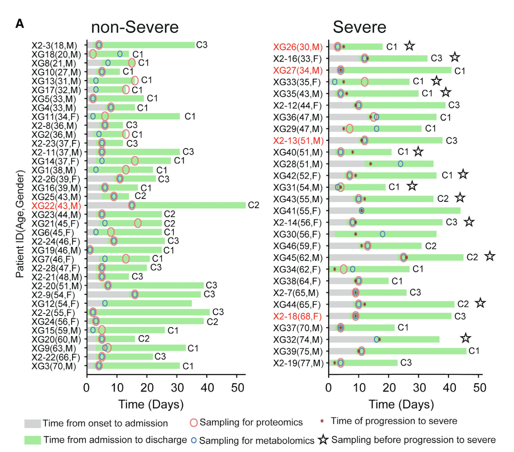
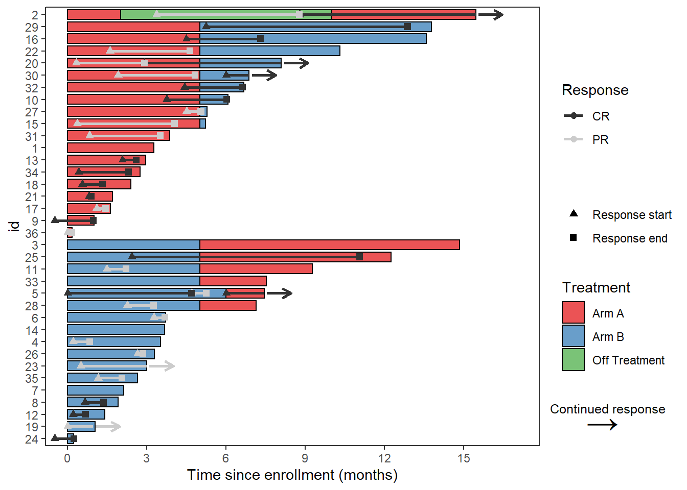
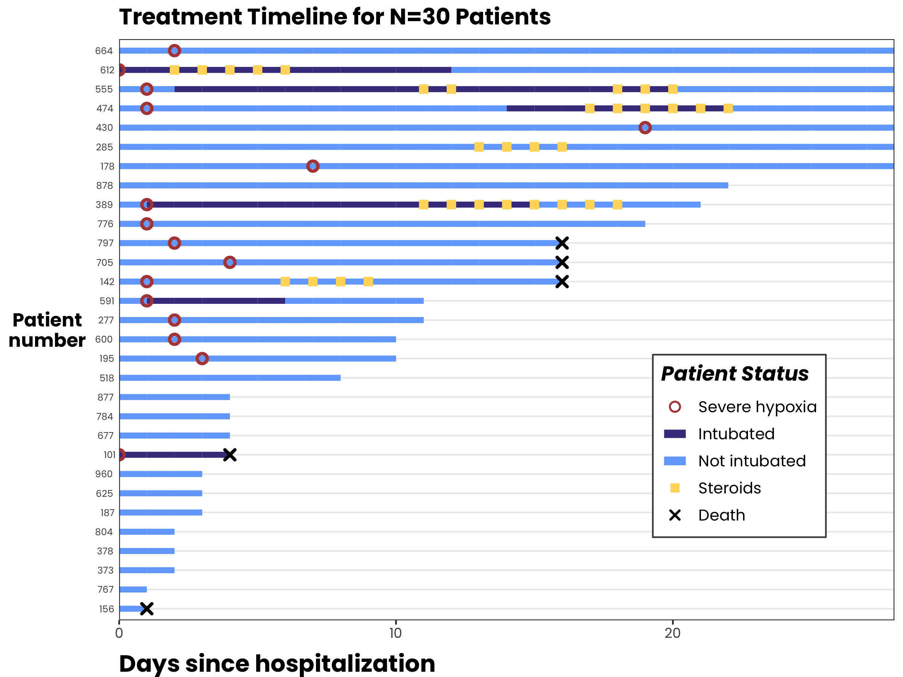
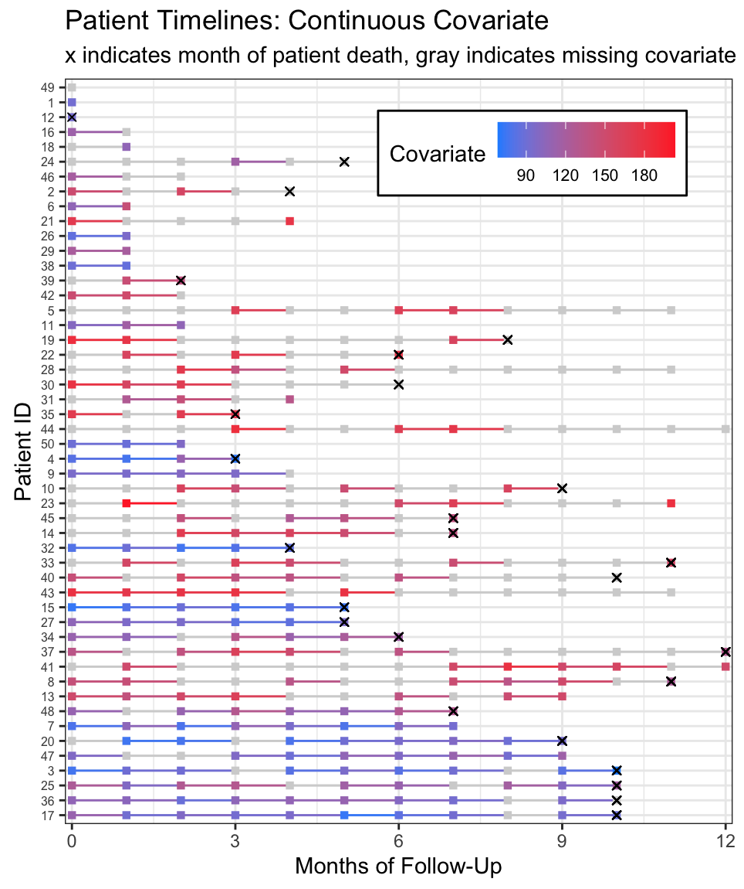

```{r xaringan-themer, include=FALSE, warning=FALSE}
library(xaringanthemer)
library(fontawesome)
library(kableExtra)
style_mono_accent(
  base_color = "#1e90ff",
  header_font_google = google_font("Josefin Sans"),
  text_font_google   = google_font("Montserrat", "300", "300i"),
  code_font_google   = google_font("Fira Mono")
)
```


```{r, include = F}
# This is the recommended set up for flipbooks
# you might think about setting cache to TRUE as you gain practice --- building flipbooks from scratch can be time consuming
knitr::opts_chunk$set(fig.width = 9, message = FALSE, warning = FALSE, comment = "", cache = T)
library(flipbookr)
library(tidyverse)
library(rmarkdown)
```

layout: true
  
<div class="my-footer"><span>kathoffman.github.io/swimmer-plots/slides.html</span></div>

---

name: xaringan-title
class: right, middle
background-image: url(img/blue-foaming-waves-north-beach-nazare-portugal.jpg)
background-size: cover

<h1 style="color: white;">Making swimmer plots for longitudinal data using {ggplot}</h1>


<h3 style="color: white;"> Kat Hoffman | August 25, 2022</h3>

---

class: middle, center

 

### Find me at:

[`r fa(name = "twitter")` @kat\_hoffman\_](http://twitter.com/kat_hoffman_)  
[`r fa(name = "github")` @kathoffman](http://github.com/kathoffman)  
[`r fa(name = "link")` khstats.com](https://khstats.com)  
[`r fa(name = "paper-plane")` kathoffman.stats@gmail.com](mailto:kathoffman.stats@gmail.com)


---

# Swimmer plot

.pull-left[
- Graphical way to show a **subject's profile over time**

- A series of horizontal lines, in which **each line represents one subject**

- **Colors or shapes** on the line **indicate treatments** or other statuses of that subject at a particular time
]
.pull-right[
```{r echo=F, out.width=600, fig.align="center", fig.cap="Image: Shen et al. Cell 182, 59–72, July 9, 2020"}

```
]

<!-- -- -->

<!-- - -->

<!-- -- -->

<!-- -  -->

<!-- -- -->

<!-- - Excellent for exploratory data analysis (EDA) of longitudinal data (e.g. visualize missigness or sampling patterns) -->

<!-- -- -->

<!--   - Can be included as a final product (e.g. manuscripts, presentations) to explain cohort composition, treatment variability, and more -->

<!-- -- -->

<!-- - While `R` packages such as `swimmer` exist, it is often faster and more customizable to write end-to-end `ggplot` code yourself -->

---

# Do we *really* have to hand-code this?

.pull-left[
- `R` packages such as `swimplot` do exist, but it is more customizable to write end-to-end `ggplot` code yourself

- Grammar of graphics is not *really* advocating plot multiple points of information to a single aesthetic, so configuring the legend correctly in `ggplot` can be tricky whether you use `swimplot` or not
]

.pull-right[
```{r out.width=500, echo=F, fig.cap="Image courtesy of {swimplot} vignette."}

```
]

---

.left-column[
### Today's swimmer plot:

We will show the timing of...
- severe hypoxia
- intubation
- steroids administration 
- 28-day mortality

...in a cohort of hospitalized COVID-19 patients.
]
.right-column[
```{r echo=F, out.width=700, fig.align="center"}

```
]

---

# Step 1: Long-form data set

.pull-left[

- ID column

- Time column (e.g. day)

- One column per status (e.g. drug A - yes/no, drug B - yes/no)

- One row per subject per unit of time
]

--

.pull-right[

```{r data1}
library(tidyverse)
library(data.table)
dat_long <- read_csv("https://raw.githubusercontent.com/kathoffman/steroids-trial-emulation/main/data/dat_trt_timeline.csv",col_types = list(id  = "c", steroids = "c", death = "c", severe = "c"))
dat_long |> data.table()
```
]

---

# Step 2: Long-form data for plotting

.pull-left[

- ID column **optional: order by maximum time per subject**

- Time column

- One column per status **which is now the time if status is "yes" and `NA` if "no"**

- One row per subject per unit of time (day)
]

--

.pull-right[

*One way to create data with a reordered patient ID (by hospital length-of-stay).*

```{r data2}
dat_reorder <-
  dat_long |>
  group_by(id) |>
  mutate(max_day = max(day)) |>
  ungroup() |>
  mutate(id = fct_reorder(factor(id), max_day))
```
]

---

# Step 2: Long-form data for plotting

.pull-left[
```{r, layout="l-body-outset"}
dat_reorder |>
  select(id, day, death) |>
   mutate(death_this_day =
           case_when(death == 1 ~ day)) |>
  data.table()
```
]


--


.pull-right[

```{r}
# data set with *_this_day columns for all statuses
dat_swim <- 
  dat_reorder |>
  mutate(severe_this_day =
            case_when(severe == 1 ~ day),
         steroids_this_day =
            case_when(steroids == 1 ~ day),
         death_this_day =
            case_when(death == 1 ~ day))
```

*Output on next slide.*

]

---

```{r}
dat_swim |>
  paged_table()
```

---

`r chunk_reveal("swim0", break_type = "user", title="# Step 3: Plot all your geometries")`

```{r swim0, include = FALSE}
dat_swim %>%
  ggplot(aes(y=id, group=id)) + #BREAK
  theme_bw() + #BREAK
  geom_line(aes(x=day, col = intubation_status)) +#BREAK
  geom_point(aes(x=steroids_this_day)) +#BREAK
  geom_point(aes(x=severe_this_day)) +#BREAK
  geom_point(aes(x=death_this_day))
```

---

`r chunk_reveal("swim1", break_type = "user", title="# Step 4: Modify geom_* layers.")`

```{r swim1, include = FALSE}
dat_swim %>%
  ggplot(aes(y=id, group=id)) + 
  theme_bw() + #BREAK
  geom_line(aes(x=day, col = intubation_status),
            size=1.8) +#BREAK
  geom_point(aes(x=steroids_this_day), 
             stroke=2,
             shape = 15) +#BREAK
  geom_point(aes(x=severe_this_day),
             size=2,
             stroke=1.5,
             shape = 21) + #BREAK
  geom_point(aes(x=death_this_day),
             size=2,
             stroke=1.5,
             shape = 4) 
```

---

# Step 5: Add colors and legend

.left-column[

]

.right-column[
**The Big Picture:**

- We want a legend which correctly maps each shape, color, and line type to the corresponding status.

- We need all of our statuses to show up in the legend. They currently do not, because they're not being mapped to an `aes`thetic argument.

- We will force all the statuses to show up by creating a new aesthetic (color) which **corresponds to the name we want each status to be labeled** in the legend.

- We will then modify this legend for "color" to also contain information about shape, linetype, etc. for each status.
]
---

`r chunk_reveal("swim2", break_type = "user", title="# Step 5: Add colors and legend")`

```{r swim2, include = FALSE}
dat_swim %>%
  ggplot(aes(y=id)) +
  theme_bw() +
  geom_line(aes(x=day,
                col = intubation_status,
                group=id),
            size=1.8) + #BREAK
  geom_point(aes(x=steroids_this_day,
                 col="Steroids"), 
             stroke=2,
             shape=15) +#BREAK
  geom_point(aes(x=severe_this_day,
                 col="Severe hypoxia"),
             size=2,
             stroke=1.5,
             shape=21) + #BREAK
  geom_point(aes(x=death_this_day,
                 col="Death"),
             size=2,
             stroke=1.5,
             shape=4) 
```

---

# Step 6: Modify colors

- We now need a key for status labels and corresponding colors.

```{r}
# define colors for all geometries with a color argument
cols <- c("Severe hypoxia" = "#b24745", # red
          "Intubated" = "darkslateblue", # navy
          "Not intubated" = "#74aaff", # lighter blue
          "Steroids"="#ffd966", # gold
          "Death" = "black") 
```

- The label of the status should match the label inputted to `aes(col = "...")`.

- The order of this color key will be the order the statuses appear in the legend.

- We will use this key as the `values` argument of `scale_color_manual()`:

---


`r chunk_reveal("swim3", break_type = "user", title="# Step 6: Modify colors")`

```{r swim3, include = FALSE}
dat_swim %>%
  ggplot(aes(y=id)) +
  theme_bw() +
  geom_line(aes(x=day,
                col = intubation_status,
                group=id),
            size=1.8) +
  geom_point(aes(x=steroids_this_day,
                 col="Steroids"), 
             stroke=2,
             shape=15) +
  geom_point(aes(x=severe_this_day,
                 col="Severe hypoxia"),
             size=2,
             stroke=1.5,
             shape=21) +
  geom_point(aes(x=death_this_day,
                 col="Death"),
             size=2,
             stroke=1.5,
             shape=4) +#BREAK
  scale_color_manual(values = cols,
                     name="Patient Status") 
```

---

# Step 7: Modify legend using override.aes()

- We need to create vectors for overriding the aesthetics for `shape`, `linetype`, `stroke`, and `size` in the current "color" legend.

  - These should be in the same order as the `cols` key
  
  - If we don't want a certain aesthetic to show up (e.g. no shape for intubation), we use `NA`

```{r}
cols
shape_override <- c(21, NA, NA, 15, 4) # order matches `cols`:severe, intubation (yes/no), steroids, death
line_override <- c(NA,1,1,NA,NA) # order matches `cols`:severe, intubation (yes/no), steroids, death
stroke_override <- c(.8,1,1,1,1) # order matches `cols`:severe, intubation (yes/no), steroids, death
size_override <- c(2.5,2.5,2.6,2,2) # order matches `cols`:severe, intubation (yes/no), steroids, death
```


---


`r chunk_reveal("swim4", break_type = "user", title="# Step 7: Modify legend using override.aes()")`

```{r swim4, include = FALSE}
dat_swim %>%
  ggplot(aes(y=id)) +
  theme_bw() +
  geom_line(aes(x=day, col = intubation_status, group=id),
            size=1.8) +
  geom_point(aes(x=steroids_this_day, col="Steroids"), 
             stroke=2, shape=15) +
  geom_point(aes(x=severe_this_day, col="Severe hypoxia"),
             size=2, stroke=1.5, shape=21) +
  geom_point(aes(x=death_this_day, col="Death"),
             size=2, stroke=1.5, shape=4) +
  scale_color_manual(values = cols,
                     name="Patient Status") + #BREAK
  guides(color = guide_legend(
           override.aes = list(
             stroke = stroke_override,
             size = size_override,
             shape = shape_override,
             linetype = line_override)
                                ))
```

```{r echo=F }
p <- dat_swim %>%
  ggplot(aes(y=id)) +
  theme_bw() +
  geom_line(aes(x=day,
                col = intubation_status,
                group=id),
            size=1.8) +
  geom_point(aes(x=steroids_this_day,
                 col="Steroids"), 
             stroke=2,
             shape=15) +
  geom_point(aes(x=severe_this_day,
                 col="Severe hypoxia"),
             size=2,
             stroke=1.5,
             shape=21) +
  geom_point(aes(x=death_this_day,
                 col="Death"),
             size=2,
             stroke=1.5,
             shape=4) +
  scale_color_manual(values = cols,
                     name="Patient Status") + #BREAK
  guides(color = guide_legend(
                        override.aes = list(
                                stroke = stroke_override,
                                size = size_override,
                                shape = shape_override,
                                linetype = line_override)
                                ))# BREAK

```

---

`r chunk_reveal("swim5", break_type = "user", title="# Step 8: Make minor theme edits")`

```{r swim5, include = FALSE}
p + labs(x="Days since hospitalization",
       y="Patient\nnumber",
       title="Treatment Timeline for N=30 Patients") + #BREAK
  scale_x_continuous(expand=c(0,0)) + #BREAK
  theme(text=element_text(family="Poppins", size=11)) +
  theme(title = element_text(angle = 0, vjust=.5,
                             size=12, face="bold"),
        axis.title.y = element_text(angle = 0, vjust=.5,
                                    size=12, face="bold"),
        axis.title.x = element_text(size=15, face="bold",
                                    vjust=-0.5, hjust=0),
        axis.text.y = element_text(size=6,
                                   hjust=1.5),
        axis.ticks.y = element_blank()) + #BREAK
  theme(legend.position = c(0.8, 0.3),
        legend.title = element_text(colour="black",
                                    size=13,
                                    face=4),
        legend.text = element_text(colour="black",
                                   size=10),
        legend.background = element_rect(size=0.5,
                                         linetype="solid",
                                         colour ="gray30")) + #BREAK
  theme(panel.grid.minor = element_blank(),
        panel.grid.major.x = element_blank()
  ) 
```

---

# In Summary 🏊

.pull-left[

- Long-format plotting data will need to have one column per status per row which indicates the **time of the status marker** to be denoted.

- Once data is properly formatted, `ggplot` can be used to make customizable swimmer plots with the `geom_line` and `geom_point` layers.

- The legend can be properly configured using the `override.aes()` argument in `guides()`.

- These ideas can be extended in many ways, such as [**showing the pattern of missing data**](https://www.khstats.com/blog/trt-timelines/trt-timelines/).
]

.pull-right[
```{r, echo=F, out.width=400, fig.cap = "Image from Patient Treatment Timelines for Longitudinal Survival Data -- KHstats, 2019"}

```
]


<!-- adjust font size in this css code chunk, currently 80 -->

```{css, eval = TRUE, echo = FALSE}
.remark-code{line-height: 1.5; font-size: 80%}

@media print {
  .has-continuation {
    display: block;
  }
}

code.r.hljs.remark-code{
  position: relative;
  overflow-x: hidden;
}


code.r.hljs.remark-code:hover{
  overflow-x:visible;
  width: 500px;
  border-style: solid;
}
```


---

class: middle, center

Thank you to the authors of `{xaringan}` and `{flipbookr}` for making these slides possible.
<br>
<br>
<br>
[`r fa(name = "twitter")` @kat\_hoffman\_](http://twitter.com/kat_hoffman_)  
[`r fa(name = "github")` @kathoffman](http://github.com/kathoffman)  
[`r fa(name = "link")` khstats.com](https://khstats.com)  
[`r fa(name = "paper-plane")` kathoffman.stats@gmail.com](mailto:kathoffman.stats@gmail.com)

 


